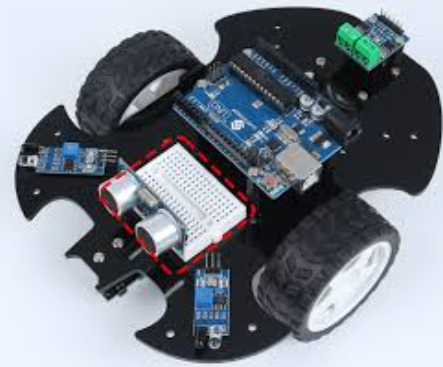

# Self Driving Car
This Arduino Uno-based autonomous vehicle uses infrared- and ultrasonic-based sensors for short and long range object detection, respectively. Using the data from these sensors, it adjusts its motion to avoid obstacles. I am considering adding a camera to this robot and incorporating image recognition into it, although this may change if time constraints or other factors do not permit it.

```HTML
You should comment out all portions of your portfolio that you have not completed yet, as well as any instructions. 
(note to self: this isn't commented out to keep it visible. it should be deleted before the website is complete.)
```

| **Student** | **School** | **Areas of Interest** | **Grade** |
|:--:|:--:|:--:|:--:|
| Dhruv P | Stratford Preparatory | Robotics | Incoming Junior |
| | Blackford | Computer Science | |

**Replace the BlueStamp logo below with an image of yourself and your completed project. (note to self: this image is a placeholder for now.) Follow the guide [here](https://tomcam.github.io/least-github-pages/adding-images-github-pages-site.html) if you need help.**



  
# Third Milestone

<iframe width="560" height="315" src="https://www.youtube.com/embed/7JM3k529tL8" title="YouTube video player" frameborder="0" allow="accelerometer; autoplay; clipboard-write; encrypted-media; gyroscope; picture-in-picture; web-share" allowfullscreen></iframe>

<!--
**Don't forget to replace the text below with the embedding for your milestone video. Go to Youtube, click Share -> Embed, and copy and paste the code to replace what's below.**

For your final milestone, explain the outcome of your project. Key details to include are:
- What you've accomplished since your previous milestone
- What your biggest challenges and triumphs were at BSE
- A summary of key topics you learned about
- What you hope to learn in the future after everything you've learned at BSE
-->

  For the third milestone of this self-driving car, I connected the two infrared sensors and the ultrasonic sensor to the Arduino Uno that was operating the car. I then programmed the car to take input from these sensors, and to alter its driving path according to the data it received. While the infrared sensors where relatively simple to code, requiring only a simple conditional for each sensor, the ultrasonic sensor required a more nuanced algorithm. The Arduino had to send a high-voltage pulse to the _trigger_ pin of the ultrasonic sensor for exactly ten seconds, measure the length of a return signal coming from the sensor's _echo_ pin, and multiply that length by the speed of sound in order to get a distance measurement from that sensor.

# Second Milestone

<iframe width="560" height="315" src="https://www.youtube.com/embed/G32riu_K6mg" title="Second Milestone" frameborder="0" allow="accelerometer; autoplay; clipboard-write; encrypted-media; gyroscope; picture-in-picture; web-share" allowfullscreen></iframe>

  The second milestone in my self-driving car project involved programming the motion for the car, without considering sensor data. The purpose of this milestone was to ensure that the car could properly move forwards, backwards, and rotate in place. I plan to build on this functionality when incorporating the car's sensors to the code in my third milestone. 

  To complete this issue, I wired the motor driver and the motors to the Arduino Uno that ran my car, also adding an on/off switch to the car so the code wouldn't start running when I wasn't ready. Building on my tester methods from my first milestone, I wrote some code that would move the car forwards, move it backwards, turn it left or right in place, or stop it. The car would need these abilities in order to properly react to obstacles it detects once it is connected to its sensors. 

  While trying to complete this milestone, I found that the car drifted to the left while trying to drive forwards or backwards. This was because the right motor turned faster than the left, despite being programmed to move at the same speed. Neither using my code to slow down the faster motor nor putting a resistor in the faster motor's circuitry could effectively solve this issue, as the motors I was using in the car were not designed to handle slower motion. These motors would alternate between operating at full speed and stopping entirely when presented with a low amperage, instead of cleanly slowing down their speed. 
  
  Internal motor differences turned out to be the issue; the motors that came with this project have loose manufacturing constraints, meaning different motors of the same model could have up to 15% differences in their RPM. After learning this, I swapped out the motors with a model that was less prone to manufacturing defects, which solved the drift issue in a more consistent manner than my other solutions. 

<!--
**Don't forget to replace the text below with the embedding for your milestone video. Go to Youtube, click Share -> Embed, and copy and paste the code to replace what's below.**

For your second milestone, explain what you've worked on since your previous milestone. You can highlight:
- Technical details of what you've accomplished and how they contribute to the final goal
- What has been surprising about the project so far
- Previous challenges you faced that you overcame
- What needs to be completed before your final milestone 
-->

## Second Milestone Code
```c++
int rightBackwardPin = 5;
int rightForwardPin = 3;
int leftForwardPin = 9;
int leftBackwardPin = 6;
int onOffSwitchPin = 7;


//code to change motor movement states
//pin map: rightBackwardPin --> right back, rightForwardPin --> right forward, leftForwardPin --> left forward, leftBackwardPin --> left back
//movement map: input --> stop, output & low --> move
void leftMotorForward() {
  pinMode(leftBackwardPin, INPUT);
  pinMode(leftForwardPin, OUTPUT);
  digitalWrite(leftForwardPin, LOW);
}

void leftMotorBackward() {
  pinMode(leftForwardPin, INPUT);
  pinMode(leftBackwardPin, OUTPUT);
  digitalWrite(leftBackwardPin, LOW);
}

void leftMotorStop() {
  pinMode(leftBackwardPin, INPUT);
  pinMode(leftForwardPin, INPUT);
}

void rightMotorForward() {
  pinMode(rightBackwardPin, INPUT);
  pinMode(rightForwardPin, OUTPUT);
  digitalWrite(rightForwardPin, LOW);
}

void rightMotorBackward() {
  pinMode(rightForwardPin, INPUT);
  pinMode(rightBackwardPin, OUTPUT);
  digitalWrite(rightBackwardPin, LOW);
}

void rightMotorStop() {
  pinMode(rightBackwardPin, INPUT);
  pinMode(rightForwardPin, INPUT);
}


//no-parameter movement code
//forward movement, backward movement, left or right rotation, and stopping
void startForward(){
  rightMotorForward();
  leftMotorForward();
}

void startBackward(){
  rightMotorBackward();
  leftMotorBackward();
}

void startRight(){
  rightMotorBackward();
  leftMotorForward();
}

void startLeft(){
  rightMotorForward();
  leftMotorBackward();
}

void stop(){
  rightMotorStop();
  leftMotorStop();
}


//time based functions for movement, rotation, and stopping
void forwardTime(int milliseconds){
  startForward();
  delay(milliseconds);
  stop();
}

void backwardTime(int milliseconds){
  startBackward();
  delay(milliseconds);
  stop();
}

void rightTime(int milliseconds){
  startRight();
  delay(milliseconds);
  stop();
}

void leftTime(int milliseconds){
  startLeft();
  delay(milliseconds);
  stop();
}

void stopTime(int milliseconds){
  stop();
  delay(milliseconds);
}


//actual code and testing
//arduino-required setup function
void setup() {

  //not related to motors or sensors
  Serial.begin(9600);
  Serial.println("program started");

  //motor pins + on/off pin
  pinMode(rightBackwardPin, INPUT);
  pinMode(rightForwardPin, INPUT);
  pinMode(leftForwardPin, INPUT);
  pinMode(leftBackwardPin, INPUT);
  pinMode(onOffSwitchPin, INPUT);

  //motor pins
  digitalWrite(rightBackwardPin, LOW);
  digitalWrite(rightForwardPin, LOW);
  digitalWrite(leftForwardPin, LOW);
  digitalWrite(leftBackwardPin, LOW);
}


bool canRunCode = false;
//arduino-required loop function
void loop() {
  if (canRunCode){
    //tester code only for now
    motorTest();
    delay(100);
    forwardBackward();
    delay(100);
    rotateLeftRight();
    delay(3000);
    timedForwardBackward(2000);
    delay(100);
    timedLeftRight(2000);
    
    //tester code I used to debug drift
    //focused on forward and backward movement
    */
    forwardBackward();
    delay(100);
    */
  }
  

  int isCircuitActive = digitalRead(onOffSwitchPin);
  Serial.println(digitalRead(onOffSwitchPin));
  if (isCircuitActive==1){
    canRunCode = true;
  } else if (isCircuitActive==0){
    canRunCode = false;
  } else { //good programming practice? (add an else block everywhere) 
    canRunCode = false;
  }
}


//tester methods
//tests if each motor can move forward and backwards
void motorTest(){
  Serial.println("motorTest executing");
  rightMotorStop();
  leftMotorStop();
  delay(2000);
  
  rightMotorForward();
  delay(1000);
  rightMotorStop();
  delay(1000);
  rightMotorBackward();
  delay(1000);
  rightMotorStop();
  delay(1000);

  leftMotorForward();
  delay(1000);
  leftMotorStop();
  delay(1000);
  leftMotorBackward();
  delay(1000);
  leftMotorStop();
  delay(1000);

}

//tests forward and backward movement
void forwardBackward(){
  Serial.println("executing forwardBackward");
  stop();
  startForward();
  delay(4000);
  stop();
  delay(1000);
  startBackward();
  delay(4000);
  stop();
  delay(1000);
}

//tests left and right rotation
void rotateLeftRight(){
  Serial.println("rotateLeftRight executing");
  stop();
  startLeft();
  delay(2000);
  stop();
  delay(1000);
  startRight();
  delay(2000);
  stop();
  delay(1000);
}

//tests methods that make the car go forward and backward for a specific amount of time
void timedForwardBackward(int milliseconds){
  Serial.println("timed forward backward executing");
  stop();
  forwardTime(milliseconds);
  stopTime(milliseconds);
  backwardTime(milliseconds);
  stopTime(milliseconds);
}

//tests methods that make the car turn right or left for a specific amount of time
void timedLeftRight(int milliseconds){
  Serial.println("timed left right executing");
  stop();
  leftTime(milliseconds);
  stopTime(milliseconds);
  rightTime(milliseconds);
  stopTime(milliseconds);
}
```

# First Milestone

<iframe width="560" height="315" src="https://www.youtube.com/embed/FzxPjumBy4o" title="First Milestone" frameborder="0" allow="accelerometer; autoplay; clipboard-write; encrypted-media; gyroscope; picture-in-picture; web-share" allowfullscreen></iframe>

  My summer intensive project is the self driving car. I chose this project because it integrates sensors and motor movement into one project. Most robots in the industry need to change their motion as a reaction to sensor inputs; a project that does just that gives me valuable experience to build on in future robotics projects. This project also has the flexibility to support many potential modifications, giving me many options to expand on it depending on which technologies I choose to gain experience with.

  I decided that constructing the self-driving car's hardware would be my first milestone. Since my main project required three milestones, and software development for this project can be separated into two milestones, (motors and sensors) completing the hardware appeared to be a sensible first milestone for this project. To complete this milestone, I attached the Arduino Uno, two motors, three wheels, a battery, a breadboard, and various sensors to the base plate of the car. In order to test the motors to make sure they worked properly, I connected the motors and the motor driver to the Arduino Uno. It turns out that the motors only rotated when their corresponding motor driver pins were connected to the ground, not to pins that source current. This surprised me, since I assumed these motor control pins were powering the motors' movement, instead of solely telling the motor driver how to control them. I adjusted to this information, using the Arduino's INPUT and OUTPUT LOW pin modes (instead of the more typical OUTPUT LOW and OUTPUT HIGH modes) to toggle whether each motor was rotating or not. Following this, I wrote some tester code to ensure that the motors could operate properly once they were programmed, and after the motors passed these tests, I decided to film my first milestone video. 

Motor Tester Code:
```c++

//methods to either stop each motor or move them forward or backward
void leftMotorBackward() {
  pinMode(leftBackwardPin, INPUT);
  pinMode(leftForwardPin, OUTPUT);
  digitalWrite(leftForwardPin, LOW);
}

void leftMotorForward() {
  pinMode(leftForwardPin, INPUT);
  pinMode(leftBackwardPin, OUTPUT);
  digitalWrite(leftBackwardPin, LOW);
}

void leftMotorStop() {
  pinMode(leftForwardPin, INPUT);
  pinMode(leftBackwardPin, INPUT);
}

void rightMotorBackward() {
  pinMode(rightBackwardPin, INPUT);
  pinMode(rightForwardPin, OUTPUT);
  digitalWrite(rightForwardPin, LOW);
}

void rightMotorForward() {
  pinMode(rightForwardPin, INPUT);
  pinMode(rightBackwardPin, OUTPUT);
  digitalWrite(rightBackwardPin, LOW);
}

void rightMotorStop() {
  pinMode(rightBackwardPin, INPUT);
  pinMode(rightForwardPin, INPUT);
}

//setting some constants as the pin numbers of the motors
int rightBackwardPin = 2;
int rightForwardPin = 4;
int leftForwardPin = 7;
int leftBackwardPin = 8;

//Arduino-required setup function
void setup(){
  Serial.begin(9600);
  Serial.println("program started");

  //set pins to input so that they are by default stopping motor rotation when the code starts
  pinMode(rightBackwardPin, INPUT);
  pinMode(rightForwardPin, INPUT);
  pinMode(leftForwardPin, INPUT);
  pinMode(leftBackwardPin, INPUT);

  //setting the pins to low current output
  //when they are set to output mode, this will prevent them from damaging the motor driver
  //which would happen from a current supply that the motor driver could not handle
  digitalWrite(rightBackwardPin, LOW);
  digitalWrite(rightForwardPin, LOW);
  digitalWrite(leftForwardPin, LOW);
  digitalWrite(leftBackwardPin, LOW);
}

//change this constant to change the speed at which the tester code runs
int timeConst = 1000;

//arduino-required loop function
void loop(){

  //stop the car before doing the testing 
  rightMotorStop();
  leftMotorStop();
  delay(2 * timeConst);

  //test the right motor's forward motion, backward motion, and stopping ability
  rightMotorForward();
  delay(1 * timeConst);
  rightMotorStop();
  delay(1 * timeConst);
  rightMotorBackward();
  delay(1 * timeConst);
  rightMotorStop();
  delay(1 * timeConst);

  //pause
  delay(2 * timeConst);

  //test the left motor's forward motion, backward motion, and stopping ability
  leftMotorForward();
  delay(1 * timeConst);
  leftMotorStop();
  delay(1 * timeConst);
  leftMotorBackward();
  delay(1 * timeConst);
  leftMotorStop();
  delay(1 * timeConst);

  //pause
  delay(2 * timeConst);
}

```

<!--
For your first milestone, describe what your project is and how you plan to build it. You can include:
- An explanation about the different components of your project and how they will all integrate together
- Technical progress you've made so far
- Challenges you're facing and solving in your future milestones
- What your plan is to complete your project
-->

# Starter Project
## Retro Arcade Console
<iframe width="560" height="315" src="https://www.youtube.com/embed/6TELPC9OSp4" title="Starter Project" frameborder="0" allow="accelerometer; autoplay; clipboard-write; encrypted-media; gyroscope; picture-in-picture; web-share" allowfullscreen></iframe>

My starter project was the Retro Arcade Console. This console simulates multiple retro video games via a CPU soldered onto a motherboard. When the user presses one of the six buttons on the console, (excluding the on/off button) the CPU identifies the button that has been pressed, and then accordingly changes the game environment. It then instructs the LCD screens on what to display in order to reflect this change.

# Schematics 
Here's where you'll put images of your schematics. [Tinkercad](https://www.tinkercad.com/blog/official-guide-to-tinkercad-circuits) and [Fritzing](https://fritzing.org/learning/) are both great resoruces to create professional schematic diagrams, though BSE recommends Tinkercad becuase it can be done easily and for free in the browser. 

<!--
# Code
Here's where you'll put your code. The syntax below places it into a block of code. Follow the guide [here]([url](https://www.markdownguide.org/extended-syntax/)) to learn how to customize it to your project needs. 

```c++
void setup() {
  // put your setup code here, to run once:
  Serial.begin(9600);
  Serial.println("Hello World!");
}

void loop() {
  // put your main code here, to run repeatedly:
  Serial.thisIsPlaceHolderCode();
}
```
-->

# Bill of Materials
Here's where you'll list the parts in your project. To add more rows, just copy and paste the example rows below.
Don't forget to place the link of where to buy each component inside the quotation marks in the corresponding row after href =. Follow the guide [here]([url](https://www.markdownguide.org/extended-syntax/)) to learn how to customize this to your project needs. 

## Starter Project 
| **Part** | **Purpose** | **Price** | **Link** |
|:--:|:--:|:--:|:--:|
| Item Name | What the item is used for | $Price | <a href="https://www.amazon.com/Arduino-A000066-ARDUINO-UNO-R3/dp/B008GRTSV6/"> Link </a> |

## Summer Intensive Project 
Base Project: 
| **Part** | **Qty** | **Purpose** | **Price** | **Link** |
|:--:|:--:|:--:|:--:|:--:|
| SunFounder 3 in 1 Starter Kit for Arduino Uno R3 | 1 | This kit provides the parts to assemble most of the car. | $69.99 | <a href="https://www.sunfounder.com/products/sunfounder-3-in-1-iot-smart-car-learning-ultimate-starter-kit?srsltid=AfmBOopqG3fJE8ARriXbo07YSeJAzOxmRQ3_DbDJ0zqd3IFKag0afaFY"> Link </a> |

Modification: 
| **Part** | **Qty** | **Purpose** | **Price** | **Link** |
|:--:|:--:|:--:|:--:|:--:|
| Switch | 2 | Used for turning the car and the remote control on and off. | $?? | addherelater.com | 
| Mini Breadboard | 1 | Used for the wiring in the remote control. | $?? | addherelater.com | 
| 9 Volt Amazon Basics Battery | 1 | Used to power the remote control. | $?? | addherelater.com | 

other unlisted parts: joystick, small jumper wires, the wire that connects the battery to the breadboard, the arduino nano, etc.

<!--
# Other Resources/Examples
One of the best parts about Github is that you can view how other people set up their own work. Here are some past BSE portfolios that are awesome examples. You can view how they set up their portfolio, and you can view their index.md files to understand how they implemented different portfolio components.
- [Example 1](https://trashytuber.github.io/YimingJiaBlueStamp/)
- [Example 2](https://sviatil0.github.io/Sviatoslav_BSE/)
- [Example 3](https://arneshkumar.github.io/arneshbluestamp/)

To watch the BSE tutorial on how to create a portfolio, click here.
-->
